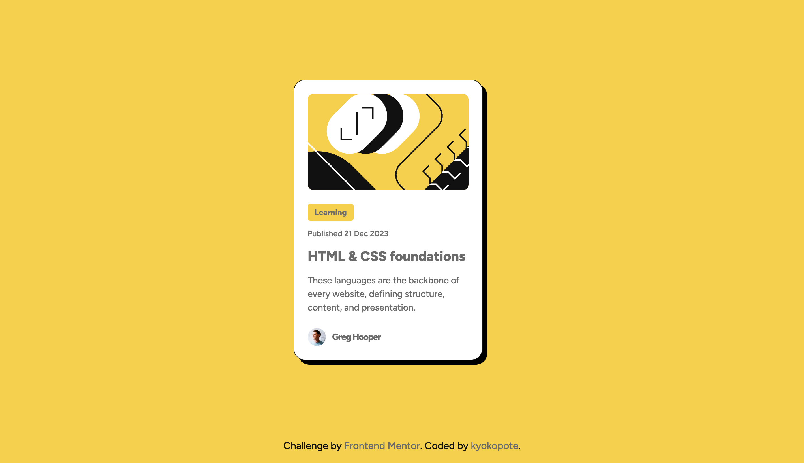

## Frontend Mentor - Blog preview card solution

This is a solution to the [Blog preview card challenge on Frontend Mentor](https://www.frontendmentor.io/challenges/blog-preview-card-cc0pydyzv8). Frontend Mentor challenges help you improve your coding skills by building realistic projects.

## 🛠️ Built with

- Semantic HTML5 markup
- CSS custom properties
- Flexbox
- Mobile-first workflow
- [Google Fonts](https://fonts.google.com/)

## ✨ What I learned

In this project, I practiced:

- Writing semantic HTML using `<figure>` and `<figcaption>`
- Using `clamp()` for fluid font-sizing
- Structuring cards with consistent padding/margin
- Managing hover states on desktop

## 📸 Screenshot

## 🔗 Live site

[View Live](https://kyokopote-stack.github.io/blog-preview-card/)

## 🙋‍♀️ Author

- GitHub - [@kyokopote](https://github.com/kyokopote)
- Frontend Mentor - [@kyokopote](https://www.frontendmentor.io/profile/kyokopote)
