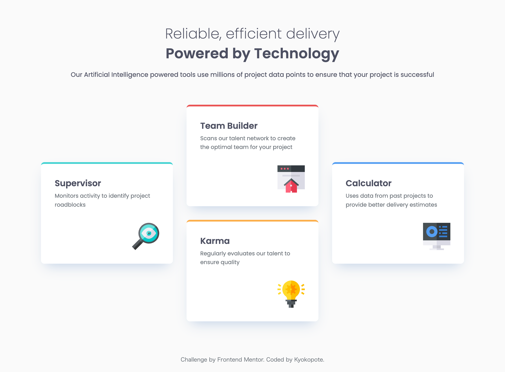

# Frontend Mentor - Four card feature section solution

This is a solution to the [Four card feature section challenge on Frontend Mentor](https://www.frontendmentor.io/challenges/four-card-feature-section-weK1eFYK).  
Frontend Mentor challenges help you improve your coding skills by building realistic projects.

## Overview

### Screenshot

### The challenge

Users should be able to:

- View the optimal layout depending on their device's screen size
- See hover states for interactive elements

## My process

### Built with

- Semantic HTML5 markup
- SCSS (Sass)
- CSS Grid
- Mobile-first workflow

### What I learned

I really enjoyed working on this challenge because Grid made it feel like solving a puzzle.  
It was fun to see how small layout changes could completely shift the design.

### Continued development

In future projects, I’d like to experiment more with **advanced grid templates** and combine them with **Flexbox** for complex layouts.

### Useful resources

- [CSS Tricks - A Complete Guide to Grid](https://css-tricks.com/snippets/css/complete-guide-grid/) - Always a go-to reference for Grid layout syntax and examples.

## Author

- Frontend Mentor - [@kyokopote](https://www.frontendmentor.io/profile/kyokopote-stack)
- GitHub - [@kyokopote](https://github.com/kyokopote-stack)
