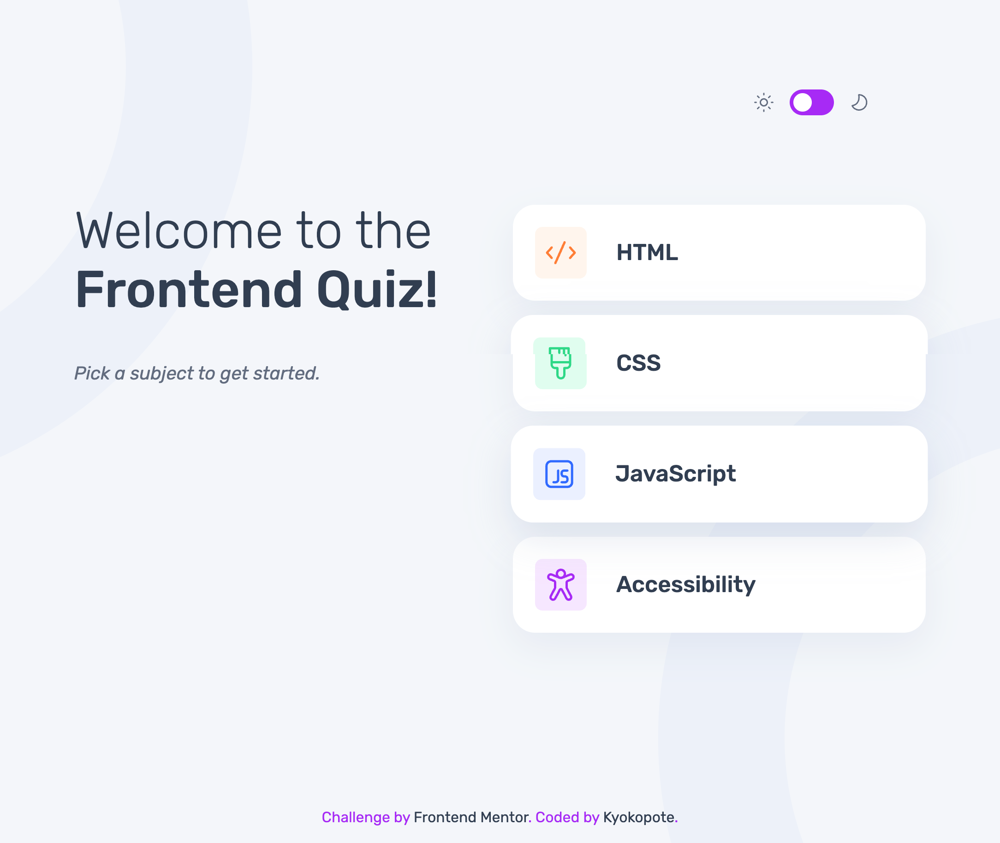

# Frontend Mentor - Frontend quiz app solution

This is a solution to the [Frontend quiz app challenge on Frontend Mentor](https://www.frontendmentor.io/challenges/frontend-quiz-app-BE7xkzXQnU). Frontend Mentor challenges help you improve your coding skills by building realistic projects.

## Table of contents

- [Overview](#overview)
- [Features](#Features)
  - [The challenge](#the-challenge)
  - [Screenshot](#screenshot)
  - [Built with](#built-with)
  - [What I learned](#what-i-learned)
  - [Continued development](#continued-development)
- [Author](#author)

## Overview

This project is a fully interactive quiz application built for the Frontend Mentor challenge.  
Users can select a quiz category, answer 10 questions, check their results, and try again.  
The application adapts to light and dark themes and is fully keyboard accessible.

### Features

- Select a quiz subject from four categories
- Answer multiple-choice questions with visual feedback (correct / incorrect)
- Progress bar that updates on each question
- Error handling when submitting without selecting an answer
- Final result screen with score summary
- Light/Dark mode with theme persistence (localStorage)
- Fully keyboard-navigable (Tab / Enter / Space)
- Responsive layout for mobile, tablet, and desktop

### The challenge

Users should be able to:

- Select a quiz subject
- Select a single answer from each question from a choice of four
- See an error message when trying to submit an answer without making a selection
- See if they have made a correct or incorrect choice when they submit an answer
- Move on to the next question after seeing the question result
- See a completed state with the score after the final question
- Play again to choose another subject
- View the optimal layout for the interface depending on their device's screen size
- See hover and focus states for all interactive elements on the page
- Navigate the entire app only using their keyboard
- **Bonus**: Change the app's theme between light and dark

### Screenshot

### Built with

- Semantic HTML5 markup
- CSS custom properties
- Flexbox
- CSS Grid
- Mobile-first workflow

### What I learned

-Learned how to fetch and use JSON data to build dynamic UI
-Understood how to efficiently generate HTML using .map() and .join()
-Learned how to manage application state (current quiz, question index, score, theme)
-Implemented full keyboard accessibility (Tab / Enter / Space)
-Added correct & incorrect answer states using conditional classes
-Built light/dark mode using CSS variables and data-theme + localStorage
-Implemented an auto-hiding error message to improve UX
-Improved code readability by separating logic into small, reusable functions

### Continued development

-I want to improve my understanding of JavaScript state management.
-I would like to deepen my skills in writing cleaner and more modular code.
-I plan to continue practicing accessibility and keyboard navigation.

## Author

- Frontend Mentor - [@kyokopote](https://www.frontendmentor.io/profile/kyokopote-stack)
- GitHub - [@kyokopote](https://github.com/kyokopote-stack)
