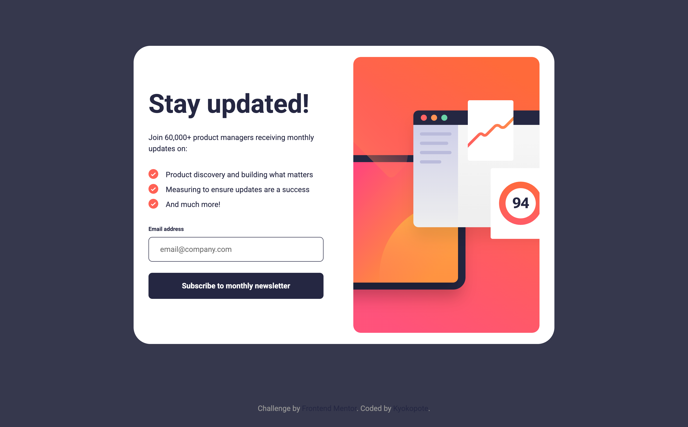

# Frontend Mentor - Newsletter sign-up form with success message

## Overview

This challenge was quite advanced for me as a JavaScript beginner.  
I relied on AI for guidance, but by taking the time to understand each syntax and flow,  
I feel like I’ve taken a couple of real steps into the world of JavaScript.

There were many tricky parts, but the one that challenged me the most was handling the `active` state.  
It behaves differently from the CSS `:active`, and after some trial and error,  
I decided to delay the toggle slightly for a smoother interaction.  
I’m looking forward to checking how other developers approached this part.

---

## Built with

- Semantic HTML5 markup
- SCSS custom properties
- Flexbox / Grid
- Vanilla JavaScript
- Mobile-first workflow

---

## What I learned

- How to handle form validation in JavaScript
- How to use the `hidden` attribute for toggling visibility
- How to control timing using `setTimeout()`
- The difference between CSS `:active` and JS class toggling

---

## Acknowledgments

This project helped me gain a much clearer understanding of how JavaScript works.  
Many thanks to the AI assistant that guided me step by step through this challenge!

## 👩‍💻 Author

- Frontend Mentor - [@kyokopote](https://www.frontendmentor.io/profile/kyokopote-stack)
- GitHub - [@kyokopote](https://github.com/kyokopote-stack)

---
