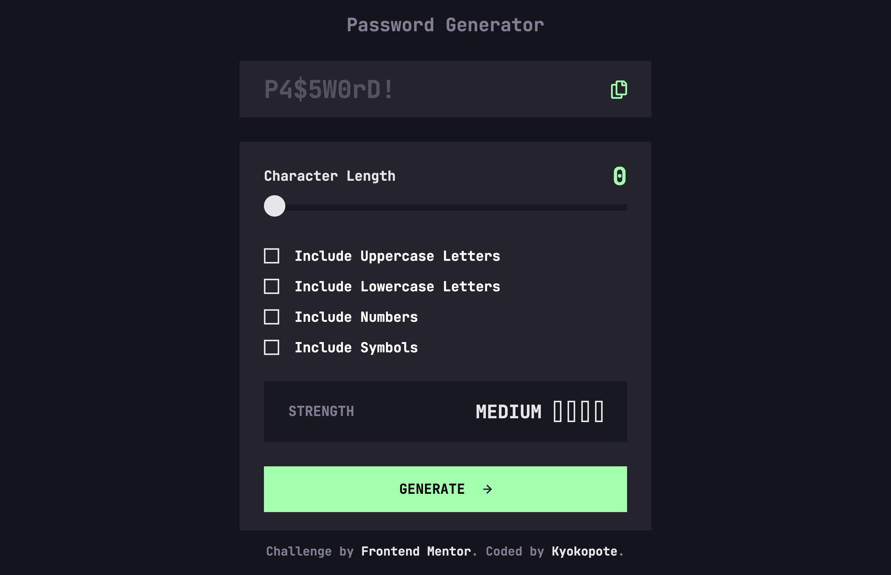

# Frontend Mentor - Password generator app solution

This is a solution to the [Password generator app challenge on Frontend Mentor](https://www.frontendmentor.io/challenges/password-generator-app-Mr8CLycqjh). Frontend Mentor challenges help you improve your coding skills by building realistic projects.

## Table of contents

- [Overview](#overview)
  - [The challenge](#the-challenge)
  - [Screenshot](#screenshot)
  - [Links](#links)
- [My process](#my-process)
  - [Built with](#built-with)
  - [What I learned](#what-i-learned)
- [Author](#author)

**Note: Delete this note and update the table of contents based on what sections you keep.**

## Overview

This app generates secure passwords based on user-selected conditions.  
You can choose character types, set the password length, and instantly check the strength level.

### The challenge

Users should be able to:

- Generate a password based on the selected inclusion options
- Copy the generated password to the computer's clipboard
- See a strength rating for their generated password
- View the optimal layout for the interface depending on their device's screen size
- See hover and focus states for all interactive elements on the page

### Screenshot

### Built with

- HTML
- SCSS (compiled to CSS)
- Vanilla JavaScript

### What I learned

- How to create a custom-styled range input (slider)
- How to build a password generator function using JavaScript
- How to use event listeners for real-time UI updates
- How to implement password strength logic
- How to use `navigator.clipboard.writeText()` to copy text
- Improved understanding of DOM manipulation and state management
- How to refactor JavaScript for clarity and cleaner structure

## Author

- Frontend Mentor - [@kyokopote](https://www.frontendmentor.io/profile/kyokopote-stack)
- GitHub - [@kyokopote](https://github.com/kyokopote-stack)
