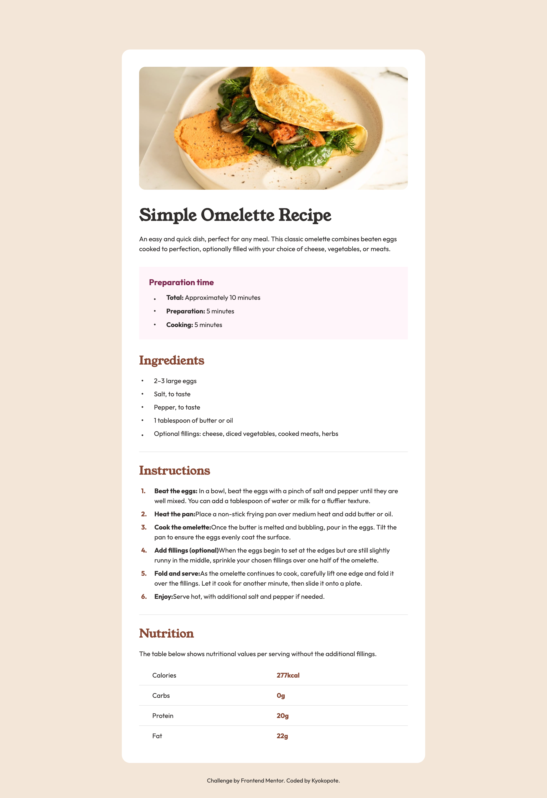

# Frontend Mentor - Recipe page solution

This is a solution to the [Recipe page challenge on Frontend Mentor](https://www.frontendmentor.io/challenges/recipe-page-KiTsR8QQKm).  
Frontend Mentor challenges help you improve your coding skills by building realistic projects.

---

## 🖼️ Overview

### Screenshot

This project is a simple recipe page that displays a dish image, preparation time, ingredients, and instructions.

---

### Links

- Solution URL: [https://github.com/kyokopote-stack/recipe-page](#)
- Live Site URL: [https://kyokopote-stack.github.io/recipe-page/](#)

---

## 🛠️ My process

### Built with

- Semantic HTML5 markup
- CSS custom properties
- CSS Grid
- Pseudo-elements (`::before`, `::after`)
- Responsive design (using relative units and consistent spacing)

---

### What I learned

I focused on recreating the list layout to match the design as closely as possible.  
It took some trial and error to get the spacing and bullet alignment right,  
but I learned a lot about how lists behave in CSS.

---

### Continued development

I want to continue improving my ability to reproduce precise designs,  
especially when using Grid layouts and pseudo-elements for decoration.

---

### Useful resources

- [MDN Web Docs](https://developer.mozilla.org/en-US/) – Great reference for CSS Grid and pseudo-elements.
- [Frontend Mentor community](https://www.frontendmentor.io/community) – Helpful place to share and get feedback.

---

## 👩‍💻 Author

- Frontend Mentor - [@kyokopote](https://www.frontendmentor.io/profile/kyokopote-stack)
- GitHub - [@kyokopote](https://github.com/kyokopote-stack)
- “I’m coding with a little help from my cat.” 🐾

---
