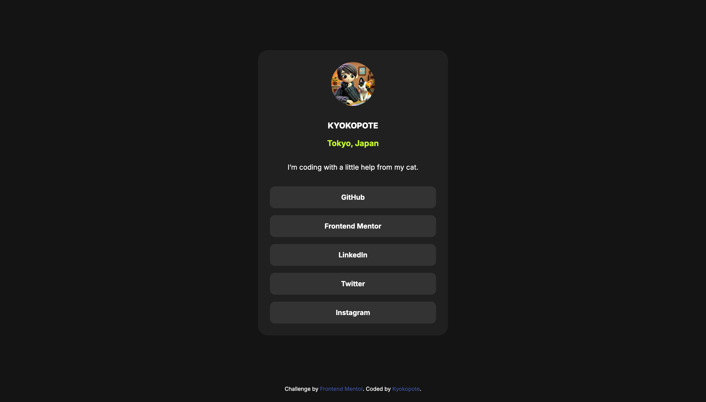

# Frontend Mentor - Social links profile solution

This is a solution to the [Social links profile challenge on Frontend Mentor](https://www.frontendmentor.io/challenges/social-links-profile-UG32l9m6dQ).  
Frontend Mentor challenges help you improve your coding skills by building realistic projects.

---

## 🖼️ Overview

### Screenshot

This project is a simple social link-sharing profile page.  
It displays the user's name, location, and several social media links.

---

### Links

- Solution URL: [Add solution URL here](#)
- Live Site URL: [Add live site URL here](#)

---

## 🛠️ My process

### Built with

- HTML5 markup
- CSS custom properties
- Flexbox
- Responsive layout using `clamp()` (no media queries)
- Semantic HTML

---

### What I learned

I’m proud that I made the card display in the center of the screen, based on my reflections from the previous challenge.  
I also managed to code without using media queries, which helped me understand how flexible the `clamp()` function can be.

---

### Continued development

I’d like to keep improving my semantic HTML structure and practice accessibility,  
so visitors can easily navigate the site with only their keyboard.

---

### Useful resources

- [MDN Web Docs](https://developer.mozilla.org/en-US/) – Clear explanations and examples for HTML and CSS.
- [Frontend Mentor community](https://www.frontendmentor.io/community) – Helpful place to share and get feedback.

---

## 👩‍💻 Author

- Frontend Mentor - [@kyokopote](https://www.frontendmentor.io/profile/Ohe)
- GitHub - [@kyokopote](https://github.com/kyokopote-stack)
- “I’m coding with a little help from my cat.” 🐾

---
