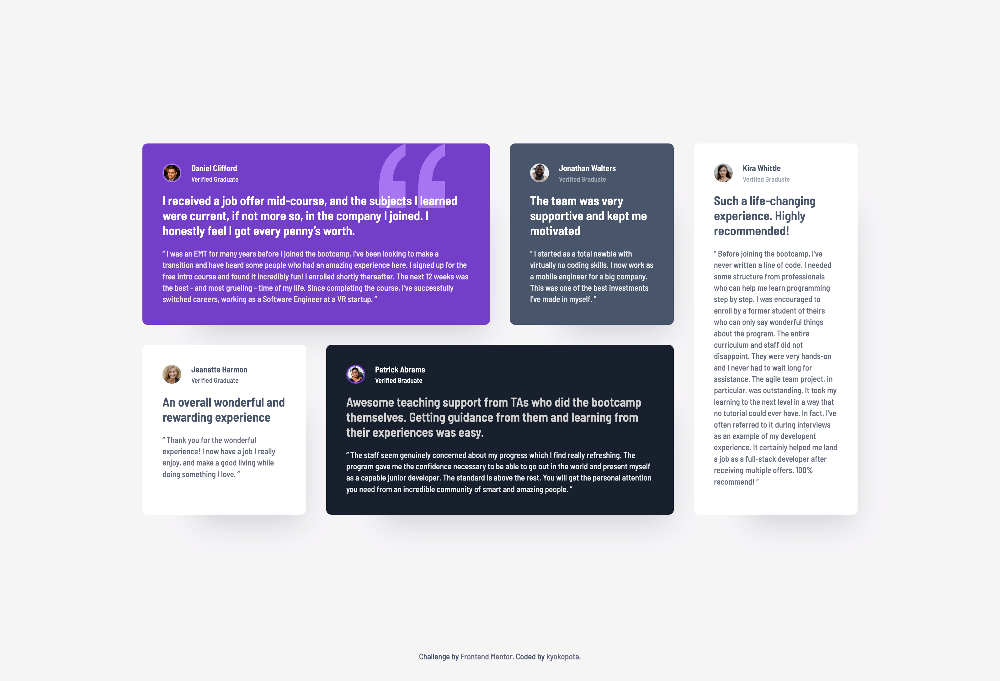

# Frontend Mentor - Testimonials grid section solution

This is a solution to the [Testimonials grid section challenge on Frontend Mentor](https://www.frontendmentor.io/challenges/testimonials-grid-section-Nnw6J7Un7).  
Frontend Mentor challenges help you improve your coding skills by building realistic projects.

---

## 🖼️ Screenshot

---

## 🧭 Overview

This project is a testimonials grid layout built with HTML and CSS.  
The goal was to recreate the layout and styling as closely as possible to the given design.

---

## 🔧 Built with

- Semantic HTML5 markup
- CSS Grid
- Flexbox (for small elements)
- Mobile-first workflow

---

## 💡 What I learned

I’m starting to get used to arranging elements in **irregular layouts using CSS Grid**.  
It was a great practice for understanding how to balance alignment and spacing.

---

## 🚀 Continued development

I want to keep improving how I structure grid areas and manage responsive design more efficiently.

---

## 👩‍💻 Author

- Frontend Mentor - [@kyokopote](https://www.frontendmentor.io/profile/kyokopote-stack)
- GitHub - [@kyokopote](https://github.com/kyokopote-stack)

---
