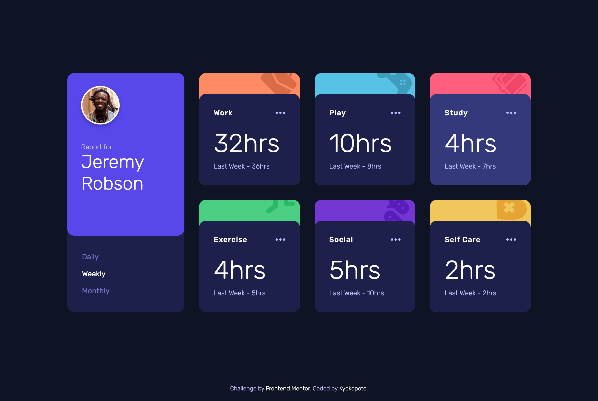

# Frontend Mentor - Time tracking dashboard solution

This is a solution to the [Time tracking dashboard challenge on Frontend Mentor](https://www.frontendmentor.io/challenges/time-tracking-dashboard-UIQ7167Jw). Frontend Mentor challenges help you improve your coding skills by building realistic projects.

## Table of contents

- [Overview](#overview)
  - [The challenge](#the-challenge)
  - [Screenshot](#screenshot)
  - [Built with](#built-with)
  - [What I learned](#what-i-learned)
  - [Continued development](#continued-development)
- [Author](#author)

## Overview

This challenge was my first time working with JSON data.
It was something I’d been wanting to try, so I found it really interesting!
I still have a lot to learn about JavaScript, but I’m enjoying the process and having fun studying it.

### The challenge

Users should be able to:

- View the optimal layout for the site depending on their device's screen size
- See hover states for all interactive elements on the page
- Switch between viewing Daily, Weekly, and Monthly stats

### Screenshot

### Built with

- Semantic HTML5 markup
- CSS custom properties
- Flexbox
- CSS Grid
- Mobile-first workflow

### What I learned

I learned how to work with JSON data.
I got a better understanding of how JavaScript flows.
I also learned a bit about how to structure HTML when using JavaScript.

### Continued development

I’d like to keep improving my understanding of JavaScript.
I also want to learn how to write cleaner, more efficient code.
Working with data and animations was really fun, so I’d like to explore more projects like this.

## 👩‍💻 Author

- Frontend Mentor - [@kyokopote](https://www.frontendmentor.io/profile/kyokopote-stack)
- GitHub - [@kyokopote](https://github.com/kyokopote-stack)
