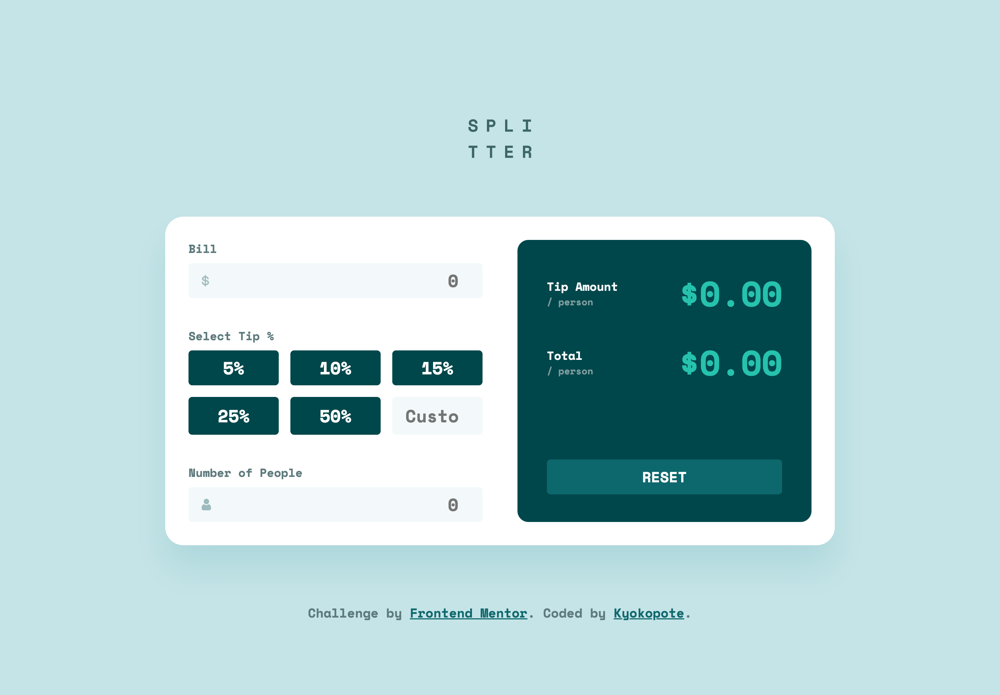

# Frontend Mentor - Tip calculator app solution

This is a solution to the [Tip calculator app challenge on Frontend Mentor](https://www.frontendmentor.io/challenges/tip-calculator-app-ugJNGbJUX). Frontend Mentor challenges help you improve your coding skills by building realistic projects.

## Table of contents

- [Overview](#overview)
  - [The challenge](#the-challenge)
  - [Screenshot](#screenshot)
  - [Built with](#built-with)
  - [What I learned](#what-i-learned)
- [Author](#author)

## Overview

This project is a simple **Tip Calculator App** built with HTML, CSS, and JavaScript.  
Users can enter a bill amount, select a tip percentage (or enter a custom one),  
and see the tip amount and total per person instantly.

The app also includes error handling for invalid inputs  
and a reset button to clear all values easily.

このプロジェクトは、HTML・CSS・JavaScript で作成したチップ計算アプリです。
ユーザーは支払金額とチップ率（または任意のパーセント）を入力すると、
1 人あたりのチップ金額と合計金額が即時に表示されます。
入力エラー処理やリセットボタン機能も含まれています。

### The challenge

Users should be able to:

- View the optimal layout for the app depending on their device's screen size
- See hover states for all interactive elements on the page
- Calculate the correct tip and total cost of the bill per person

### Screenshot

### Links

- Solution URL: [Add solution URL here](https://your-solution-url.com)
- Live Site URL: [Add live site URL here](https://your-live-site-url.com)

### Built with

- Semantic HTML5 markup
- CSS custom properties
- Flexbox
- CSS Grid
- Mobile-first workflow

### What I learned

I really struggled to put the JavaScript together for this project.  
But by taking it one line at a time, I was finally able to make it work  
and learned a lot in the process!

## 👩‍💻 Author

- Frontend Mentor - [@kyokopote](https://www.frontendmentor.io/profile/kyokopote-stack)
- GitHub - [@kyokopote](https://github.com/kyokopote-stack)
